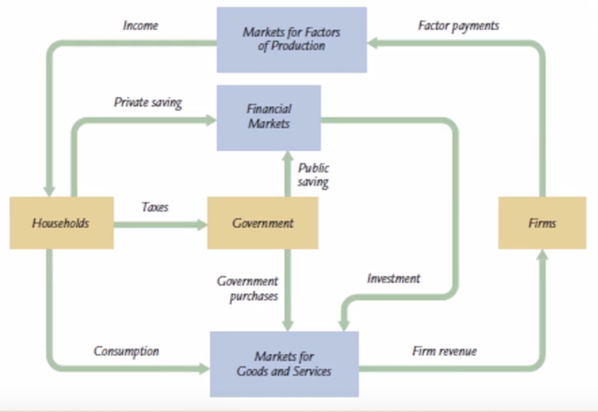

# 宏观经济学

## 1 宏观经济学的数据

衡量宏观经济表现的三个指标：GDP，价格指数，失业率

### 1.1 国内生产总值

国家或经济体在一定时期内生产的全部最终产品和服务的市场价值总和

#### 测算方式

- **本地**：与谁所有无关，关心的是范围内经济活跃程度
  - 中国生产的 iPhone 手机计算，纽约中国银行业务收入不计算
- **总值**：与"净值"对应，没有剔除重复部分
  - 当年生产的资本品还没有全部转移到新产品中去的，要计算资本品价值和新产品总价值，这样当年转移折旧部分价值就被重复计算了
    > 原则上 GDP 不重复计算，但是折旧的部分不得不重复计算，如果将折旧部分剔除可以得到国内生产净值 NDP.
- **最终**：只计算最终产品和服务，其中已经包含中间产品的价值
  - 煤炭卖给居民就计算，卖给电厂就不计算
- **市场价值**
  - 以市场价值作为不同产品和服务的加总计量单位
- **一定时期**：国内生产总值是流量概念
- **测算生产**
  - 不计算土地租金，但计算土地价值当年增长量

#### 特殊项目处理

- 包括：住宅提供服务，政府提供的服务
- 不包括：地下经济活动（虽然反映了生产结果，但是无法统计）, 耐用品提供的服务
  > 将汽车看做耐用品，不计算在非生产年的 GDP 当中；但是将住宅看做资本品，以估算租金计入非生产年的 GDP

#### 与 GDP 相关的指标

国民生产总值 (GNP 或 GNI)=GDP+本国居民在境外获得收入-国外居民在本国获得的收入
国民收入/国内收入：按照生产要素贡献分配给每一个生产要素所有者的收入

|                              | 国内生产总值 | 国内生产净值 | 国内收入 | 个人收入 | 个人可支配收入 |
| :--------------------------: | :----------: | :----------: | :------: | :------: | :------------: |
|             折旧             |      ○       |              |          |          |                |
|  间接税（营业税/增值税等）   |      ○       |      ○       |          |          |                |
| 保留利润/公司利得税/社会保险 |      ○       |      ○       |    ○     |          |                |
|     个人所得税/行政支付      |      ○       |      ○       |    ○     |    ○     |                |
|   个人工资收入/股息收入等    |      ○       |      ○       |    ○     |    ○     |       ○        |
|   政府向企业补贴/税收减免    |              |              |    ○     |    ○     |       ○        |
|         政府转移支付         |              |              |          |    ○     |       ○        |

#### 构成

##### 支出角度

- 消费
- 总投资
  - 固定投资
    - +净固定投资
    - +重置投资
  - 存货投资
    - +期末存货存量
    - -期初存货存量
- 政府购买
- 国外净购买
  - -进口
  - +出口

##### 收入角度

- 工资收入
- 资本金利息
- 租金
- 企业保留利润
- 折旧
- 政府净收入
  - +税收
  - -政府转移支付

#### GDP 核算存在的问题

- GDP 不等同于经济福利
  - 一些有价值的活动未能计入：家务活动，地下经济，闲暇
- 产品质量的改善未被正确估算
- 不能带来福利改善的产品被计入
  - 武器
- 对人们福利的负面影响未被剔除
  - 如污染

GDP 着眼于生产结果，尤其是通过市场反映了其价值的生产的结果
如果着眼于人们福利是否改善，GDP 核算存在很大局限性

#### 名义 GDP 与实际 GDP

因为要考察 GDP 增长是由价格上涨还是生产增加，将价格变化剔除掉后（用统一的价格测算不同年份的生产）得到实际 GDP.

如果把 GDP 计算过程看做对数量进行加权加总，那么同一年的名义 GDP 和以某标准价格测算的实际 GDP 可以反映价格变化：

$$
    GDP 平减指数=\frac{名义 GDP}{实际 GDP} \times 100
$$

### 1.2 价格指数

#### 编制方法

$W_i$ : 第 $i$ 件商品权重
$P_{i\_t}$ : 第$i$件商品在$t$年的价格
$P_{i_0}$ : 第$i$件商品的基年价格

> 当用商品数量作为商品权重时，该价格指数就是 GDP 平减指数

$$
价格指数=\frac{ W_1P_{1\_t} + W_2P_{2\_t} + \cdots } { W_1P_{1\_0} + W_2P_{2\_0} + \cdots } \times100
$$

#### 价格指数的分类

- GDP 平减指数（见上，略）
- 消费物价指数 CPI:
  计算消费者日常消费的若干种产品种类和固定的权重（称为一篮子产品）作为纳入考虑的商品种类和权重
- 生产物价指数/批发物价指数 PPI:
  若干种类商品按照出厂价格计算

> GDP 平减指数和 CPI 的区别
>
> - 构成：GDP 平减指数包含所有产品，CPI 选取部分产品
> - 权重：GDP 平减指数用产量作权重，CPI 是事先确定的固定权重
> - 是否包括进口：GDP 平减指数不包括进口产品，CPI 可以包含进口产品

### 1.3 失业率

16 周岁以上有劳动能力的人中分为以下两类

- 非劳动力人口：家庭主妇，学生，不打算找工作的人
- 劳动力
  - 已获得工作
  - **_未获得工作_**

$$
失业率=\frac{失业人数}{劳动力} \times100
$$

$$
劳动力的参与率=\frac{劳动力}{成年人口}\times100
$$

---

## 2 国民收入的生产，分配，使用

本章假设前提（对于长期经济来看，这些假设可以是现实的）:

1. 货币对经济没有实际作用：不影响劳动力投入/资源使用/技术进步等
2. 封闭经济（为分析方便不讨论开放经济，考虑开放经济也不影响基本结论）
3. 充分就业：所有资源充分利用，尤其是劳动力
4. 生产要素既定
5. 价格能够灵活调整

### 2.1 总产出的分配

在市场经济中，产出通过要素市场分配给各个要素所有者。每个要素实际上通过要素价格获得自己的份额。要素价格取决于要素供给和需求。

总产量=劳动报酬+利息和租金+超额利润

> 如果在完全竞争条件下，收入分配的边际生产力理论成立，超额利润为 0
> 即：总产量=劳动报酬+利息和租金

### 2.2 总产出的需求/供给与产品市场均衡

**总产出的需求方面**：消费+投资+政府购买

> 没有售出的产品视作被企业购买，计入投资

各方面的决定因素：

- 消费：可支配收入的增函数（总收入的增函数，税收的减函数（将税收看做常数，与收入利率无关））
- 投资：利息率的减函数（利息率越高=>占用资金成本越高=>投资减少）
- 将政府购买看做外生变量，是一个常数

**总产出的供给方面**：产量=F(资本，劳动)（F 是生产函数）

在长期而言，假设劳动和资本是固定数，那么总产出的供给也是一个常数

**均衡条件下**：一定时期内的总产出（总供给）=总支出（总需求）

> 在 GDP 核算中的总需求是事后计算的；产品市场均衡中的总需求是事先计划的（购买前愿意购买多少）
> 其中，消费（因为消费是自由的）和政府购买（因为是外生变量）的事后计算值与事先计划值是相等的。而 事后的实现投资=计划投资+非计划投资
> GDP 恒等式的投资是实现投资（事后计算）, 均衡公式里的投资属于意愿投资（事先计划）

### 2.3 储蓄，投资与金融体系

居民，企业和政府通过生产要素市场，商品市场，金融市场完成宏观经济循环流转：

**供给和需求的均衡可以被转化为储蓄与投资的均衡 ：**

国内生产总值的构成：

- 从收入角度：
  GDP = 个人可支配收入 + 税收 - 政府转移支付 + 折旧 + 企业留存利率
  =（消费+个人储蓄）+（税收-政府转移支付）+ 企业储蓄
  = 消费 +（个人储蓄+企业储蓄）+（税收-政府转移支付）
  = 消费 + 私人储蓄 + 净税收
- 从支出角度：
  GDP = 消费 + 投资 + 政府购买 + 净出口净额

由于：消费 + 投资 + 政府购买 + 净出口净额 = 消费 + 私人储蓄 + 净税收
且：（净税收 - 政府购买）就是公共储蓄/政府储蓄

可以得到几个重要恒等式：

1. 投资 + 净出口 = 私人储蓄 + （净税收 - 政府购买）
   - 对国内和国外的总投资（这里是事后实现的投资） = 国内储蓄
2. 投资 = 私人储蓄 + （净税收 - 政府购买）+ 净进口
   - 国内总投资 = 国内储蓄 + 国外储蓄
3. 私人储蓄 - 投资 = 政府赤字 + 净出口净额
   - 多于投资的储蓄两个去向：弥补政府财政赤字，对外净出口
   - 通过政府赤字或对外出口解决私人投资的不足/储蓄过剩
4. 政府赤字 = 私人储蓄 - 投资 + 净进口
   - 弥补财政赤字的两个来源：多于投资的储蓄，进口

### 2.4 储蓄和投资的含义与构成,及两者关系

**储蓄**就是前期生产出来的产品尚未消耗掉的部分,也就是可以在未来拿出来使用的.
储蓄意味着可贷资金的供给.

储蓄的构成:

- 私人储蓄
  - 个人储蓄
  - 企业储蓄
- 政府储蓄(公共储蓄): 总税收 - 转移支付 - 政府购买

储蓄行为: 存款,买债券,买股票,借钱出去...

    宏观经济学中的储蓄与日常用语的储蓄是不同的

**(实物)投资**: 对资本品或中间产品的购买,是增加资本存量的行为.
投资意味着对可贷资金的需求.
投资结果: 增加当期需求,增加下期供给能力.

    本课程中的投资一般指实物投资.金融投资(购买证券)是间接投资,本身不会增加资本存量.

投资行为:

- 企业兴建厂房,购置机器设备,购买原材料等
- 企业未售出的货物也计入投资
- 居民户购买住宅

储蓄和投资的关系:

- 行为不同: 储蓄表示拥有的收入没有被消费,投资表示没有消费掉的产品投入了生产.两者是同一批产品,当然在数值上相等.
- 储蓄必然会转化为投资,不管是意愿还是超出意愿的.储蓄是投资的来源,投资是储蓄的去向.
- 投资是区分意愿投资和超出意愿投资的,但是储蓄必然是意愿的.

### 2.5 从产品市场均衡到金融体系均衡

从事后的角度来说,储蓄和投资必然相等,我们关注的是事先计划的投资能不能够与储蓄保持相等.
在现代金融体系下,通过市场机制作用,计划投资会与储蓄趋于相等.

储蓄转化为投资的途径:资金通过金融中介机构(商业银行,保险公司等),或直接通过金融市场流向企业,企业利用获得的可贷资金变为资本品.

金融体系均衡的内在机制: 由于意愿投资(可贷资金供给)是利率的函数,(假设)储蓄是常量,可贷资金市场的供求机制使利率改变,以调节意愿投资和储蓄相等.

### 2.6 均衡点的变化

所有外在冲击对均衡点的影响都分为两类:对可贷资金供给的影响和对可贷资金需求的影响

- 财政扩张的影响:
  增加开支/减少税收 => 储蓄减少 => 可贷资金减少 => 利率上升 => 投资减少 (政府购买产品多了,留给企业购买的产品就少了,企业用作投资的产品就少了)
  > 排挤效应:政府开支增加挤占了私人开支,这种挤占是通过提高利率来实现的
- 企业投资意愿增加:
  此时如果考虑到现实中储蓄是利率的增函数(而不是一个常量), 可贷资金需求增加 => 利率上升 =>储蓄上升 (利率和储蓄都上升了)

---

## 3 货币与物价

### 3.1 货币体系

**货币**:用于市场交换的一种资产存量.货币是流动性最好的资产.

**货币的功能**:

- 交易媒介
- 价值储藏
- 计价单位

**货币的测度**:

- M0: 通货(现金)
- M1: M0 + 活期存款
- M2: M1 + 定期存款

**货币供给:** 经济中流通的货币存量, 一般特指 M1.

关于货币供给过程的几个概念:

- **再贴现**: 商业银行向央行借款. 这是央行向市场发放货币量的途径
- **通货存款比率(cu)**: 通货在 M1 中所占比例. 比率影响货币供给,因为居民持有通货而不存入商业银行,商业银行就无法发放贷款.
- **基础货币(MB)**: 直接由央行发行出来的,所有其他货币赖以产生的那种货币.又称高能货币
  - 一般来自央行(香港是例外,来自商业银行)
  - 可以派生更多货币(商业银行吸收存款再发放贷款再吸收存款...)
  - 是央行对公众的负债
  - 数量与构成上: 基础货币 = 准备金 + 通货

**货币供给过程:**

通过中央银行发行基础货币,商业银行不断吸收存款再贷放出来,最终形成了远多于基础货币的货币供应量.

- 通货存款比率为零(M1 全部以活期存款形式存在)的情形:
  - $M1=基础货币+商业银行创造的货币=\frac{基础货币MB}{准备金率}$
  - 准备金(RE) = 基础货币(MB)
- 通货存款比率大于零(实际中通常的情况)的情形:
  - $M1=\frac{1+通货存款比率}{准备金率+通货存款比率}\times基础货币$
  - 准备金(RE) + 通货 = 基础货币(MB)

### 3.2 货币的需求和供给

货币的交易数量方程式:
$$货币量\times交易流通速度=价格水平\times交易次数$$
其中交易次数和总产出是有关联的,可以认为交易次数是总产出的某个倍数, 这样就可以得到货币的收入数量方程式:
$$货币量\times收入流通速度=价格水平\times总产出$$
这里的收入流通速度是指每个产出对应的货币量交易的速率.现实中,这两个公式中的流通速度是基本不变的.

上述两个方程式中的货币量就是名义货币供给,即市场中的货币余额.实际货币供给是名义货币供给 ➗ 价格水平.
货币需求是总产出的一个小于一的倍数,也就是一个常数.

从长期来看,货币供求一定能够达到相等--如果货币供给大于货币需求,那么价格水平就会上升,实际货币供给下降;如果货币供给小于货币需求,那么价格水平就会下降,实际货币供给上升.

    货币数量方程式到底说了什么?
    - 如果 货币量 理解为货币需求,那么公式可以理解为货币需求函数
    - 如果 货币量 理解为货币供给,那么公式说明了物价是如何决定的
    - 方程式包含了供求两方面,描述了货币数量论

### 3.3 货币数量论与古典二分法

货币数量论实质上是解释通货膨胀的古典理论.

<u>长期来看:</u>产量决定于技术和资源,与货币无关.
根据 3.2 中的货币收入数量方程式:

- 货币数量只影响价格水平,通过价格水平影响名义收入
- 物价水平取决于货币数量和总产出
- 如果产量是固定的,那么货币量和物价成正比

古典通货膨胀理论:

- 通货膨胀是一个货币现象
- 这个理论是解释长期通货膨胀现象的

货币中性: 货币只影响名义水平,不影响实际变量

货币数量论表明,货币超发是发生通货膨胀的充要条件,央行是引发通货膨胀的根源,也是控制通货膨胀的主力.

**二分法** 认为产量和就业的决定因素与物价的决定因素是没有关联的.二分法在长期来看是正确的.二分法意味着需要区分名义变量和实际变量,也意味着货币是中性的.

### 3.4 通货膨胀对经济的影响

温和的预期到的通货膨胀的影响: 带来经济损失

- 鞋底成本: 为避免通货膨胀损害而付出努力所付出的时间与精力成本
- 菜单成本: 提前改变价目单的成本
- 扭曲相对价格导致资源错配
- 发出错误的价格信号,干扰判断:短期内很难判断出相对价格变化
- 税收扭曲:名义收入以通货膨胀率增加,但因为进入更高纳税等级纳税增多,实际收入减少

短期内未预期到的通货膨胀影响: 收入再分配

- 有利于:雇主,债务人,收入灵活者
- 不利于:职员,债权人,固定收入者

温和通货膨胀的可能好处:

- 引导相对价格调整
- 促进充分就业: 实际工资降低,鼓励公司雇佣更多工人

## 4 短期经济波动理论：AS-AD 模型

短期内经济波动是通过影响供给或需求两个方面产生的.

宏观经济学中的时间维度:

- 短期(假定技术和资本存量既定)
  - 短期总供给曲线(价格,工资是刚性的): 因为时间太短无法调整或完全调整
  - 长期总供给曲线(价格,工资可以充分灵活调整): 时间相对较长,可以充分调整
- 长期(生产能力增长,供给需求相等)

> 实际上生产能力每时每刻都在变化,但是我们假定短期内是不变的,以便问题的分析. "长期 "表示的是一种趋势,即当前的生产能力趋于增长,供需趋向平衡.

### 4.1 总需求(AD)分析

总需求曲线

总需求受价格因素和非价格因素影响.其中,价格因素对总需求影响通过曲线倾斜方向表示,非价格因素对总需求的影响通过曲线整体移动来表示.

    总需求(事先计划总支出) = 私人消费 + 私人投资 + 政府购买 + 净出口

为什么总需求曲线向右下方倾斜:

1. 财富效应: 价格下降,人们更富有(购买力增加),**消费增加**.
2. 利率效应: 价格下降,货币需求减少,购买股票债券,利率下降,**投资增加**.
3. 汇率效应: 价格降低,利率下降,资产外逃,购买外汇,本币贬值,**出口增加,进口减少**.

总需求曲线的移动:

1. 消费方面: 利率,消费信心,股票市场,税收政策
2. 投资方面: 利率,技术进步,商业信心,政府购买
3. 政府购买开支的财政政策: 政府购买,转移支付(通过影响可支配收入影响私人消费)
4. 国际经济因素: 汇率,国外价格,国外经济景气

### 4.2 总供给分析

总供给曲线表示物价对总供给影响,曲线整体移动表示物价以外因素的影响.
产品价格调整可能不是实时的(不同于股票市场),因此区分短期(SRAS)和长期(LRAS)总供给曲线.

#### 长期总供给曲线

长期: 总供给与一般物价无关,取决于潜在的产量水平,总供给曲线是垂直的.但是动态地来看,生产能力提升, LRAS 会右移.

当总需求曲线左移时,总供给与长期总需求曲线的交点会如下图变动.这反映的是最终的变化趋势,短期内一般无法调整至该水平.

#### 短期总供给曲线

短期内至少部分商品价格为刚性.
短期总供给曲线反映了价格未充分调整时,一般物价和总供给之间的关系.这种关系存在多种情形,现只考虑两种(实际上的曲线可能是两者的结合或其他形式)

##### SRAS 1:水平的情形

在离充分就业很远的时候价格往往是固定的

- 经济极度萧条时,在给定的价格下,企业供给根据需求增减而不调整价格
- 极端时期
- 极短期内价格来不及调整

##### SRAS 2:倾斜的情形

随价格的提高,总供给增加

- 一般出现在接近充分就业的时候
- 时间较长,价格部分调整

当总需求由 AD2 左移至 AD1 时,总产出会先降低到 A 点(价格来不及调整),然后总产出和总需求会沿 AD1 增加到 F 点达到短期均衡.此时仍然存在失业,仍然会趋向于达到长期均衡,即 LRAS 和 AD1 的交点.

#### 从短期到长期

通过市场机制,在足够长的时间后可以达到长期均衡(有达到长期均衡的趋势).如下图,总需求曲线(AD),短期总供给曲线(SRAS),长期总供给曲线(LRAS)交于一点.

如果长期均衡被某种原因被打破(例如总需求减少),那么一定先恢复短期均衡,再恢复长期均衡

- 首先 总需求减少在瞬间带来失衡,供过于求
- 然后 价格下降,总供给和总需求沿新的总需求曲线增加,达到短期均衡
- 最后 仍然存在产品积压,产能过剩,所以会继续降低价格,总需求和总供给继续增加,直到达到长期均衡

> 从最终状态上来看,虽然价格从 P1 降低到 P3,但是工人和企业福利没有减少,因为这里的 P 是一般价格,也就是说,名义价格下降,购买力不变.不过在短期波动过程中,两者福利都收到了损失.

## 5 短期经济波动的总需求分析 I：乘数原理

## 6 短期经济波动的总需求分析 II：IS-LM 模型

## 7 通货膨胀、失业与菲利普斯曲线

## 8 长期经济增长

## 9 开放经济理论
